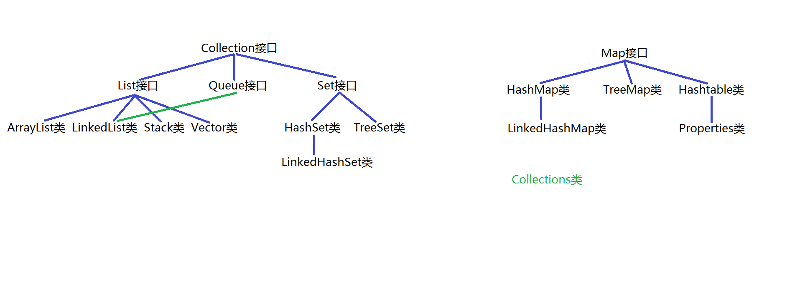

# 集合类库

  

## 1. 集合概述
### 1.1 集合由来
* 单个数据：变量
* 多个类型相同的数据：一维数组
* 多个类型不同的数据：对象
* 多个类型相同的对象数据：对象数组
* 多个类型不同的对象：集合

### 1.2 集合的框架结构
* 顶层框架：java.util.Collection集合和java.util.Map集合
* Collection存取单个元素
* Map存取单对元素

## 2. Collection集合

### 2.1 基本概念
* java.util.Collection接口是List接口、Queue接口和Set接口的父接口

### 2.2 常用方法

| 方法声明 | 功能介绍 |
| --- | --- |
| boolean add(E e) | 向集合中添加元素 |
| boolean addAll(Collection <? extends E> c) |  |
| boolean contains(Object o) |  |
| boolean acontainsAll(Collection<?> c) |  |
| boolean retainAll(Collection<?> c) | 保留当前集合中存在且参数集合中存在的所有对象，交集 |
| boolean remove(Object o) |  |
| boolean removeAll((Collection<?> c) |  |
| void clear() |  |
| int size() |  |
| boolean isEmpty() |  |
| boolean equals() |  |
| int hashCode() |  |
| Object[] toArray() |  |
| Iterator<E> iterator() | 获取当前集合的迭代器 |

## 3. Iterator接口

### 3.1 基本概念
* java.util.Iterator接口主要用于描述迭代器对象，可以遍历Collection集合中所有元素
* java.util.Collection接口继承Iterator接口，因此实现Collection接口的实现类都可以使用该迭代器对象

### 3.2 常用方法

| 方法声明 | 功能介绍 |
| --- | --- |
| boolean hasNext() | 判断集合中是否有可以迭代的元素 |
| E next() | 取出一个元素并指向下一个元素 |
| void remove() | 删除访问到的最后一个元素 |

## 4. List集合

### 4.1 基本概念

* java.util.List集合是Collection集合的子集合，有序，允许有重复的元素
* 主要实现类：ArrayList、LinkedList、Stack、Vector
* ArrayList底层采用动态数组进行管理，支持下标访问，增删元素不方便
* LinkedList底层采用双向链表进行数据管理，访问不方便，增删元素方便
* Stack采用动态数组，先进后出
* Vector采用动态数组，与ArrayList比属于线程安全的类，效率比较低

### 4.2 常用方法

| 方法声明 | 功能介绍 |
| --- | --- |
| void add(int index, E element) | 向集合指定位置添加元素 |
| boolean addAll(int index,Collection<? extends E> c) | 向集合添加所有元素 |
| int indexOf(Object o) |  |
| int lastIndexOf(Object o) |  |
| E set(int index, E element) |  |
| E remove(int index) |  |
| List subList(int fromIndex, int toIndex) |  |

## 5. Queue集合

### 5.1 基本概念
* java.util.Queue集合是Collection集合的子集合，与list集合属于平级关系
* 先进先出的数据结构
* 主要实现类是LinkedList，增删方便

### 5.2 常用方法

| 方法声明 | 功能介绍 |
| --- | --- |
| boolean offer(E e) | 将一个对象添加至队尾，添加成功返回true |
| E poll(E e) | 从队首删除一个元素并返回 |
| E peek(E e) | 返回队首元素（不删除） |

